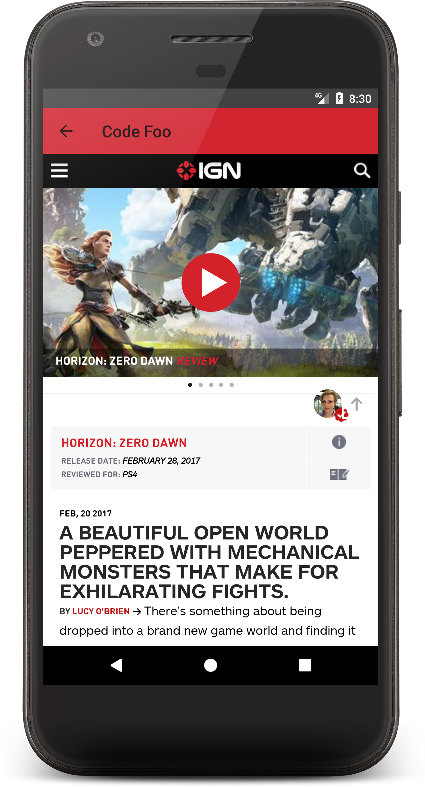

# CodeFoo
This is the main repository for the source code for the android app.

### Link for Lincoln Logs Empire State Building solution
This is my solution to building the Empire State Building out of Lincoln Logs.   
https://github.com/Tyler98ky/CodeFoo/tree/master/Code%20Foo%20Lincoln%20Logs
### Link for Chained Grid Challenge
This is the link to the chained grid part of the application, in another repo.   
https://github.com/Tyler98ky/Code-Foo-Grid

### Link for YouTube video
IGN Code Foo 2017   
https://www.youtube.com/watch?v=B9JbSnUSFCs

# Description of the App
Hi, so the application said to build a native app that as closely as possible resembled the current IGN mobile app's design, while making any changing I thought would make sense. I took this pretty drastically, and chose to completely change the design of the ap to the modern specifications of UI guidelines of native android apps, material design. I still used the api to pull a list of the articles and display each article, but I made some design changes. First off, integeral to this material design specification, I used a fairly new android feature called CardViews and Recyclers. The Card Views, which you can see in the screenshots below, are the actual objects of each article. Each article is displayed on its own Card View. This is a much more modern approach to the UI than the alternative of making each article a part of a simple android List View, and more importantly, follows the new android convention of material design. Each one of these Card Views currently hold the title of the article, an image of the article, and the time elapsed since the article was published (which I know makes less sense in this application since the API uses articles that were posted a month ago, but in actual practice in would follow IGN's current article layouts on the website and app). This material design places heavy emphasis on shadows and the 3 dimensional feel you get from using the design pattern. In this app, shadows are used to make each card feel as if they are floating above the background of the screen, and then as you scroll, slid underneath the title bar of the application. This 3 dimensional effect is quite nice from a user experience perspective. My app's design is still very simplistic however, but I did this to use the app as more of a template for what changes I would make, rather than create a perfect example of material design.

## Screenshots

